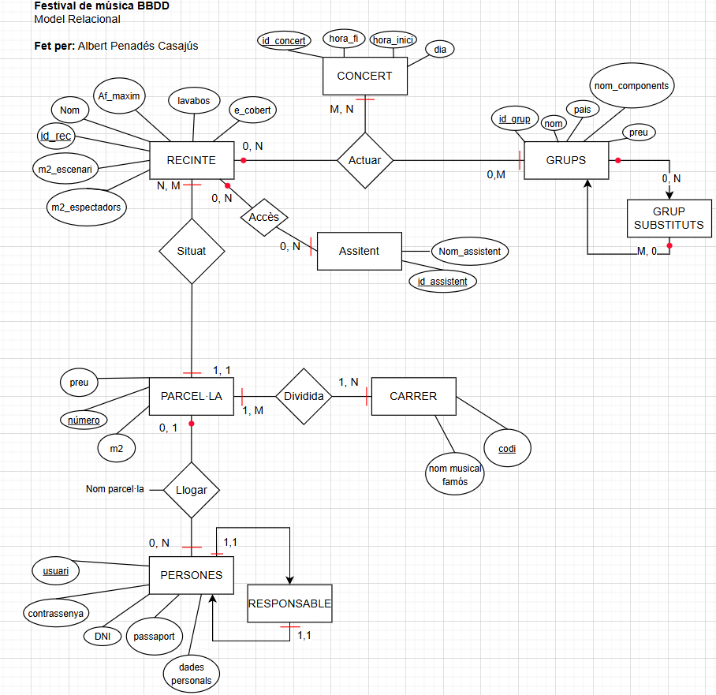

# activtat_festival_musica_DDBB

## Descripció
### Aquest projecte consisteix en el disseny i la implementació d'una base de dades relacional per gestionar un festival de música organitzat per un ajuntament. La base de dades cobreix aspectes com la gestió dels recintes, els grups musicals contractats, les substitucions, la zona d'acampada i els accessos dels assistents als recintes.

## Estructura de base de dades
### La base de dades consta de les entitats següents:
#### Recinte: Informació sobre els recintes on es fan les actuacions, incloent el nom, la mida de l'escenari i la zona dels espectadors, l'aforament, la presència de lavabos i si l'escenari està cobert.
#### Grup: Registre dels grups musicals, amb atributs com el nom, el país d'origen, el nombre de components i el preu per actuació.
#### SubstitutGrup: Relació que connecta un grup amb els grups que poden actuar com a substituts.
#### Concert: Informació sobre els concerts programats, incloent el recinte, el grup que actua, la data, l'hora d'inici i de finalització.
#### Carrer i Parcel·la: Gestió de la zona d'acampada, amb parcel·les organitzades per carrers identificats per codis i noms.
#### Persona: Informació dels assistents al festival, incloent l'usuari, contrasenya, DNI/passaport, i altres dades personals.
#### Lloguer: Registra quina persona ha llogat una parcel·la específica.
#### Acces: Històric dels accessos dels assistents als recintes.